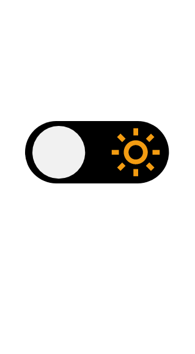
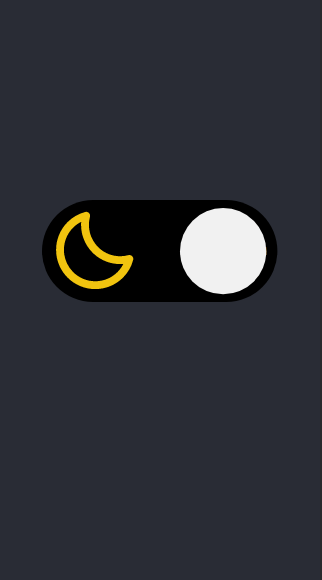
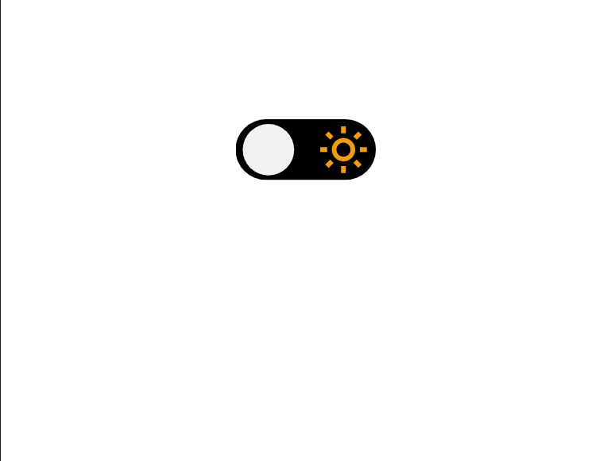

# Desafio "Theme Switcher"

Nesse projeto, da plataforma [rocketseat](https://app.rocketseat.com.br/discover), tem como principal objetivo alternar entre o tema dark e light.

## Stack utilizada

**Front-end:** HTML, CCS, JavaScript

## Layout

## Vendo na prática

[link](https://devamauryjunior-change-theme.netlify.app)